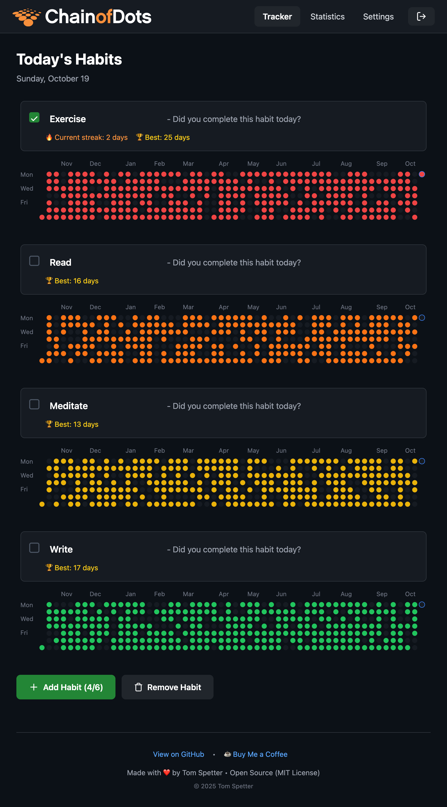

# HabitDot - Simple Habit Tracking

**Version: 1.0.0**

A beautiful, minimalist habit tracker with a year-at-a-glance view. Track up to 6 daily habits with color-coded circular dots inspired by GitHub's contribution graph.

> **Note:** Now with secure authentication, statistics, and account management!



## Features

### Core Tracking
- **Year-at-a-Glance View**: 365-day calendar grid showing your entire year
- **6 Color-Coded Habits**: Track up to 6 different habits with rainbow colors (red, orange, yellow, green, blue, purple)
- **Circular Dots**: Clean, minimal circular indicators for each day (matching the "HabitDot" brand)
- **Streak Tracking**: Current streak and best streak for each habit
- **Quick Daily Tracking**: Check off today's habits with one click
- **Auto-Save**: Changes are automatically saved to the server

### Statistics & Analytics
- **Time Period Filters**: View stats for last 7 days, 30 days, or full year
- **Completion Rates**: Percentage completion for each habit
- **Overall Dashboard**: Total check-ins, average completion rate, best performing habit
- **Visual Progress Bars**: Color-coded progress indicators per habit

### Account Management
- **Email-Based Authentication**: Secure user accounts with email verification
- **Email Verification**: 6-digit verification codes sent via Brevo API
- **Password Reset**: Secure password recovery with 6-digit verification codes
- **Password Management**: Change your password anytime from settings
- **Data Export**: Download your data as CSV (user-friendly) or JSON (complete backup)
- **Data Import**: Restore from CSV or JSON files
- **Account Deletion**: Permanently delete your account and all data

### Security
- **Email Verification**: Required email verification for new account registration
- **Password Reset Flow**: Secure 3-step password recovery with verification codes
- **CSRF Protection**: Protected against cross-site request forgery attacks
- **Rate Limiting**: Login attempt limiting to prevent brute force attacks (5 attempts, 15-min lockout)
- **Code Expiration**: Verification codes expire after 15 minutes
- **Attempt Limiting**: Maximum 5 attempts per verification code
- **Session Management**: 1-hour session timeout with automatic renewal
- **Server-Side Storage**: All data stored securely on the server (no localStorage)
- **Protected Data Directory**: `.htaccess` blocks direct file access
- **Email Enumeration Prevention**: Password reset doesn't reveal if email exists

### Design
- **Clean Dark Theme**: GitHub-inspired dark interface for comfortable viewing
- **Mobile Responsive**: Works seamlessly on desktop and mobile devices
- **Responsive Navigation**: Hamburger menu on mobile, full nav on desktop

## Getting Started

### Requirements

- PHP 7.4 or higher
- Web server (Apache recommended for `.htaccess` support)
- Email service account (Brevo/Sendinblue recommended - free tier available)
- cURL extension enabled in PHP

### Installation

1. Download or clone this repository
2. Place files in your web server directory
3. Ensure the `app/data/` directory is writable by the web server
4. **Configure Email Service** (required for registration and password reset):
   ```bash
   cd app/
   cp email_config.sample.php email_config.php
   nano email_config.php  # Edit with your Brevo API key and settings
   ```

   To get a Brevo API key:
   - Sign up at [Brevo](https://www.brevo.com) (free tier: 300 emails/day)
   - Go to **Settings** → **API Keys** → Create a new API key
   - Add your sender email and verify your domain (see DNS setup section below)

5. Start your web server (or use PHP's built-in server for testing):
   ```bash
   php -S localhost:8000
   ```
6. Open `http://localhost:8000` in your web browser (marketing site)
7. Click "Launch App" to access the habit tracker at `http://localhost:8000/app/`
8. Click "Register" to create your account
9. Check your email for the 6-digit verification code
10. Start tracking your habits!

### Email DNS Setup (for production)

For emails to be trusted and not marked as spam, add these DNS records to your domain:

1. **SPF Record** (authorize Brevo to send on your behalf)
2. **DKIM Record** (cryptographically sign your emails)
3. **DMARC Record** (policy for handling unauthenticated emails)

Brevo provides these records in **Senders & IP** → **Domains** after you add your domain. Add them as TXT records in your DNS settings.

### First Time Setup

1. Navigate to the app in your browser
2. Click "Don't have an account? Register"
3. Enter your email address
4. Choose a strong password (min 8 characters)
5. Click "Send Verification Code"
6. Check your email for the 6-digit code
7. Enter the code to complete registration
8. Start tracking your habits!

## Deploying to a Public Server

⚠️ **Important**: Additional security steps are required for public deployment.

### Prerequisites

- Web server with PHP 7.4+ (Apache/Nginx)
- SSL/TLS certificate (HTTPS is **required**)
- Domain name
- SSH access to server

### Deployment Steps

1. **Enable HTTPS First**

   ```bash
   # Use Let's Encrypt for free SSL
   sudo certbot --apache -d yourdomain.com
   ```

2. **Upload Files**

   ```bash
   # Via Git
   git clone your-repo.git /var/www/yourdomain.com

   # Or via SFTP/SCP
   scp -r HabitTracker/ user@server:/var/www/yourdomain.com/
   ```

3. **Set Proper Permissions**

   ```bash
   # Make data directory writable by web server only
   sudo chown -R www-data:www-data /var/www/yourdomain.com/data
   sudo chmod 700 /var/www/yourdomain.com/data
   sudo chmod 600 /var/www/yourdomain.com/data/*
   ```

4. **Configure Apache Virtual Host**

   ```apache
   <VirtualHost *:443>
       ServerName yourdomain.com
       DocumentRoot /var/www/yourdomain.com

       SSLEngine on
       SSLCertificateFile /path/to/cert.pem
       SSLCertificateKeyFile /path/to/key.pem

       <Directory /var/www/yourdomain.com>
           AllowOverride All
           Require all granted
       </Directory>

       # Security headers
       Header always set Strict-Transport-Security "max-age=31536000; includeSubDomains"
       Header always set X-Content-Type-Options "nosniff"
       Header always set X-Frame-Options "DENY"
   </VirtualHost>

   # Redirect HTTP to HTTPS
   <VirtualHost *:80>
       ServerName yourdomain.com
       Redirect permanent / https://yourdomain.com/
   </VirtualHost>
   ```

5. **Update PHP Configuration**

   ```bash
   # Edit php.ini for production
   sudo nano /etc/php/8.x/apache2/php.ini
   ```

   Set these values:

   ```ini
   expose_php = Off
   display_errors = Off
   log_errors = On
   session.cookie_secure = On
   session.cookie_httponly = On
   ```

6. **Test the Deployment**

   - Visit `https://yourdomain.com`
   - Verify HTTPS is working (green padlock)
   - Test registration and login
   - Check that data saves properly

7. **Set Up Backups**
   ```bash
   # Cron job to backup data directory daily
   0 2 * * * tar -czf /backups/habit-data-$(date +\%Y\%m\%d).tar.gz /var/www/yourdomain.com/data/
   ```

### Security Checklist for Production

- [ ] HTTPS enabled and enforced
- [ ] Data directory has 700 permissions
- [ ] JSON files have 600 permissions
- [ ] PHP `display_errors` is Off
- [ ] PHP `expose_php` is Off
- [ ] `.htaccess` files are in place
- [ ] Regular backups configured
- [ ] Firewall configured (only 80/443 open)
- [ ] Keep PHP and server software updated
- [ ] Monitor server logs regularly

### Recommended: Additional Hardening

For extra security on public servers:

1. **Rate Limiting at Server Level**

   ```apache
   # Add to .htaccess
   <IfModule mod_ratelimit.c>
       SetOutputFilter RATE_LIMIT
       SetEnv rate-limit 400
   </IfModule>
   ```

2. **Fail2Ban Configuration**

   ```bash
   sudo apt install fail2ban
   # Configure to ban IPs after failed login attempts
   ```

3. **Database Migration** (Optional)
   - Consider migrating from JSON to MySQL/PostgreSQL for better performance and security at scale

See [SECURITY.md](SECURITY.md) for complete security documentation.

## Usage

### Habit Tracking
- **Add a Habit**: Click "Add Habit" button (max 6 habits)
- **Rename a Habit**: Click on the habit name to edit it
- **Mark Today**: Use the checkbox next to each habit name
- **Mark Any Day**: Click on any circular dot in the calendar grid
- **Remove a Habit**: Click "Remove Habit" button, then click the trash icon next to a habit
- **Auto-Save**: Changes are automatically saved to the server

### Navigation
- **Tracker**: Main habit tracking page (default view)
- **Statistics**: View analytics and insights for your habits
- **Settings**: Manage your account, export/import data, change password
- **Logout**: Click the logout button in the navigation bar

### Data Management
- **Export as CSV**: Download readable spreadsheet format (open in Excel/Google Sheets)
- **Export as JSON**: Download complete backup in JSON format
- **Import Data**: Restore from previously exported CSV or JSON files (auto-detected)
- **Delete Account**: Permanently remove your account and all associated data

## Security Features

✅ **Implemented Security Measures:**

- Email verification required for new accounts (6-digit codes)
- Secure password reset flow with verification codes
- Bcrypt password hashing
- Server-side session management
- CSRF token protection on all state-changing requests
- Login rate limiting (5 attempts, 15-minute lockout)
- Verification code rate limiting (60-second resend cooldown)
- Session timeout (1 hour with automatic renewal)
- Code expiration (15 minutes for verification, 5 minutes for reset tokens)
- Maximum attempt limiting (5 attempts per verification code)
- Email enumeration prevention (password reset doesn't reveal if user exists)
- Protected data directory (`.htaccess` blocks direct access)
- Security headers (X-Frame-Options, XSS Protection, etc.)

See [SECURITY.md](SECURITY.md) for full security details.

## Roadmap

### ✅ Completed Features (v1.0.0)

- **Email-Based Authentication System**
  - Email verification with 6-digit codes (via Brevo API)
  - Secure password reset flow with verification codes
  - Email enumeration prevention
  - Rate limiting and code expiration
- **User Account Management**
  - Server-side authentication with bcrypt password hashing
  - CSRF protection on all state-changing requests
  - Login rate limiting (5 attempts, 15-min lockout)
  - Session management with 1-hour timeout
- **Habit Tracking**
  - Year-at-a-glance calendar (365 days with circular dots)
  - 6 color-coded habits (rainbow palette)
  - Streak tracking (current streak + best streak)
  - Auto-save functionality
- **Statistics & Analytics Page**
  - Time period filters (7 days, 30 days, year)
  - Completion percentages and rates
  - Overall dashboard with best performing habit
  - Color-coded progress bars
- **Account Settings Page**
  - Change password
  - Export data (CSV and JSON formats)
  - Import data (auto-detect CSV/JSON)
  - Delete account with confirmation
- **Marketing Site**
  - Professional landing page with feature highlights
  - About, Contact, and documentation pages
  - HabitDot branding and logo
- **Design & UX**
  - Responsive navigation (desktop + mobile hamburger menu)
  - Mobile responsive design
  - GitHub-inspired dark theme
  - Accessible UI with ARIA labels

### 💡 Future Enhancements (Post v1.0)

- **Better Mobile UX**: Larger tap targets, swipe gestures, improved scrolling
- **Dark/Light Theme Toggle**: User-selectable color schemes
- **Email Reminders**: Daily notifications and streak alerts (requires email integration)
- **Achievement Badges**: Milestone celebrations (7-day, 30-day streaks, etc.)
- **Database Support**: Option to use MySQL/PostgreSQL instead of JSON files
- **Two-Factor Authentication**: Optional 2FA for enhanced security
- **Multi-year Support**: View and track habits across multiple years

## Technology Stack

### Frontend

- React 18 (via CDN)
- Tailwind CSS (via CDN)
- Pure JavaScript (ES6+)

### Backend

- PHP 8.3+
- JSON file-based storage
- Session-based authentication

## File Structure

```
HabitTracker/
├── index.html          # Marketing landing page
├── about.html          # About page
├── contact.html        # Contact page
├── app/                # Main application
│   ├── index.html      # Habit tracker (React frontend)
│   ├── config.php      # Configuration and security functions
│   ├── api/
│   │   ├── auth.php    # Authentication endpoints
│   │   ├── account.php # Account management endpoints
│   │   ├── data.php    # Data storage/export/import endpoints
│   │   └── .htaccess   # Security headers
│   └── data/
│       ├── .htaccess   # Blocks direct file access
│       ├── users.json  # User credentials (hashed)
│       ├── user_*.json # Per-user habit data
│       └── login_attempts.json # Rate limiting data
├── images/
│   ├── logo.svg        # HabitDot logo
│   └── preview.png     # Screenshot for marketing site
├── README.md           # This file
└── SECURITY.md         # Security documentation
```

## License

**Code:** MIT License - Free to use, modify, and distribute.

**Logo/Branding:** © Tom Spetter - Please use your own branding when forking or deploying your own instance.

## Contributing

This is a personal project. Feel free to fork and modify for your own needs!

## Security Note

✅ **This version implements proper security practices** including password hashing, CSRF protection, and rate limiting. It is suitable for personal use on a local server or trusted hosting environment.

⚠️ **For production deployment**: Always use HTTPS and ensure proper server configuration. See [SECURITY.md](SECURITY.md) for deployment recommendations.
